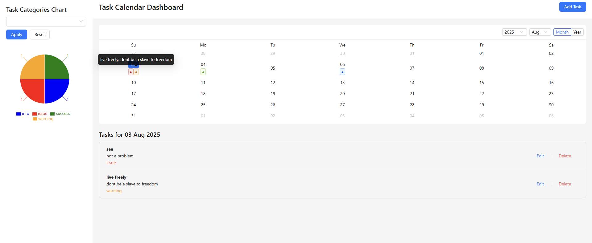
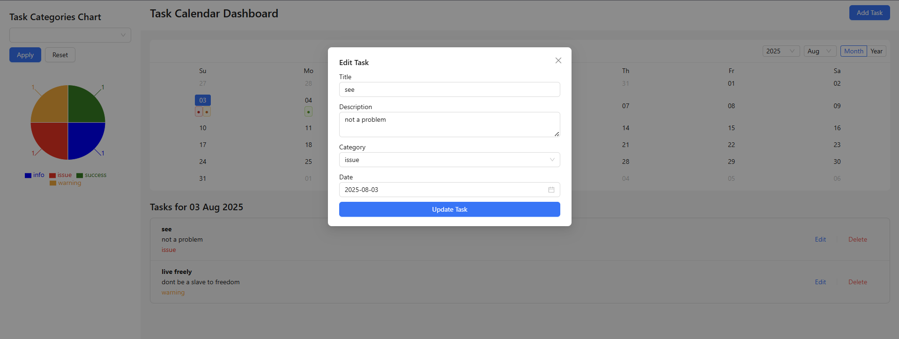
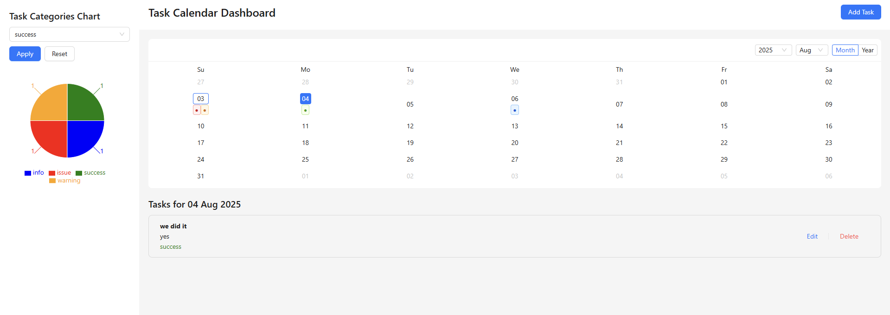

# 📅 Task Calendar Dashboard

A React application built with **Ant Design**, **Redux Toolkit**, and **Formik + Yup** to manage daily tasks.  
Users can add, view, edit, delete, and categorize tasks on a calendar interface and visualize them through charts.

---

## 🚀 Live Demo
[Click here to view the live app](https://task-calendar-dashboard-efxpzoutq-raghus-projects-1dccba79.vercel.app/)  

---

## 🎯 Objective
To build a **daily task manager** with calendar-based task organization and visual analytics.

---

## ✨ Features

### 📆 Calendar View
- Ant Design `<Calendar />` with clickable dates.
- **Colored dots** under dates to indicate task categories.
- **Hover tooltips** showing task title and description.
- Only Month view (cleaner UI).

### 📝 Add/Edit Tasks
- **Formik + Yup** form validation.
- Fields:
  - Title (required)
  - Description (optional)
  - Date (auto-filled, editable)
  - Category (success, warning, issue, info)
- Auto-fills fields in Edit mode.

### 📋 Task Listing
- Displays tasks for the selected date.
- Edit/Delete actions available.
- Category tags are color-coded.

### 📊 Chart Visualization
- **Pie chart** (Recharts) showing task counts per category.
- Category filter with Apply and Reset buttons.
- Filter affects only the task list for the selected date.

### 💾 State Management
- **Redux Toolkit** for all state.
- Persistent storage using `localStorage`.
- Fix for ID issue: ensures every task has a unique string ID.

---

## 🛠️ Tech Stack
- **ReactJS**
- **Ant Design**
- **Redux Toolkit**
- **Formik + Yup**
- **Recharts**
- **Day.js** for date formatting

---

## 📂 Project Structure
src/
│
├── redux/
│ ├── store.js
│ └── tasksSlice.js
│
├── App.js
├── index.js
├── index.css
└── ...


---

## ⚡ Getting Started

### 1️⃣ Clone the repository
```bash
git clone https://github.com/RaghuSharma14/task-calendar-dashboard.git
cd task-calendar-dashboard

2️⃣ Install dependencies
npm install

3️⃣ Run the app
npm start

4️⃣ Build for production
npm run build
```

## 🐛 Known Issues & Fixes
Delete not working: Fixed by assigning unique string IDs (nanoid) to all tasks, including those loaded from localStorage.

## 📸 Screenshots
### Calendar View with Task Dots


### Add/Edit Task Modal


## Chart & Filters


---
## 👨‍💻 Author
Raghu Sharma

Email: raghusharma70876@gmail.com

GitHub: RaghuSharma14
